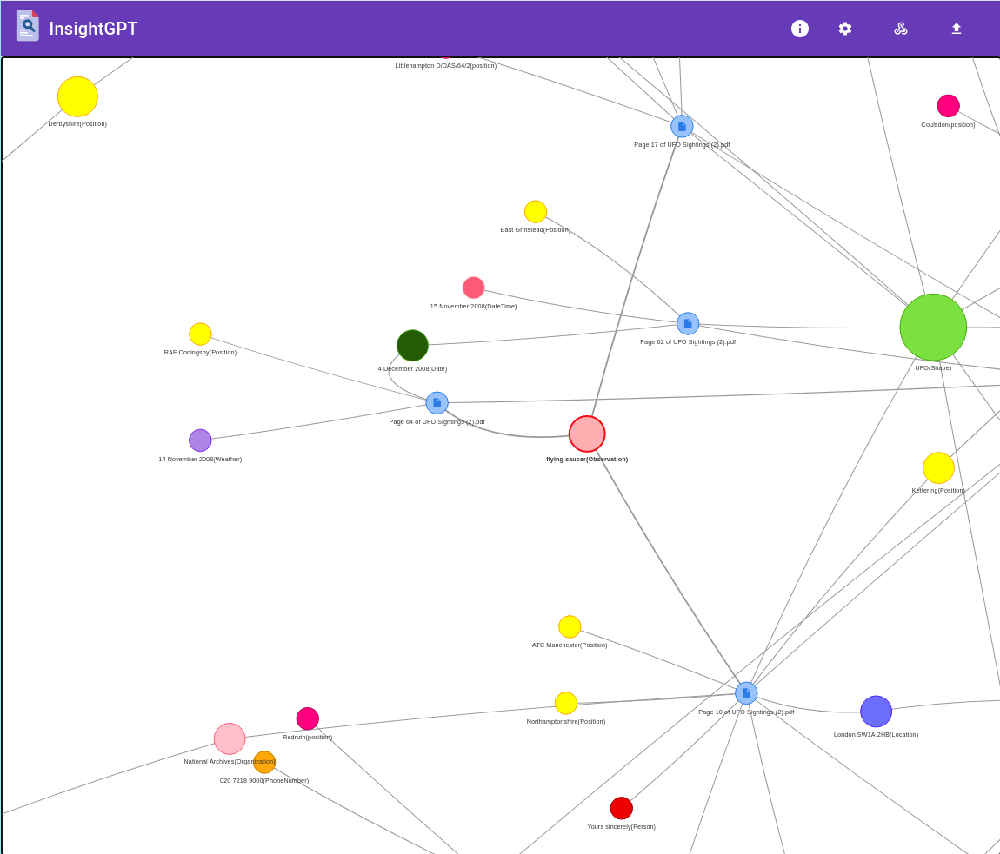
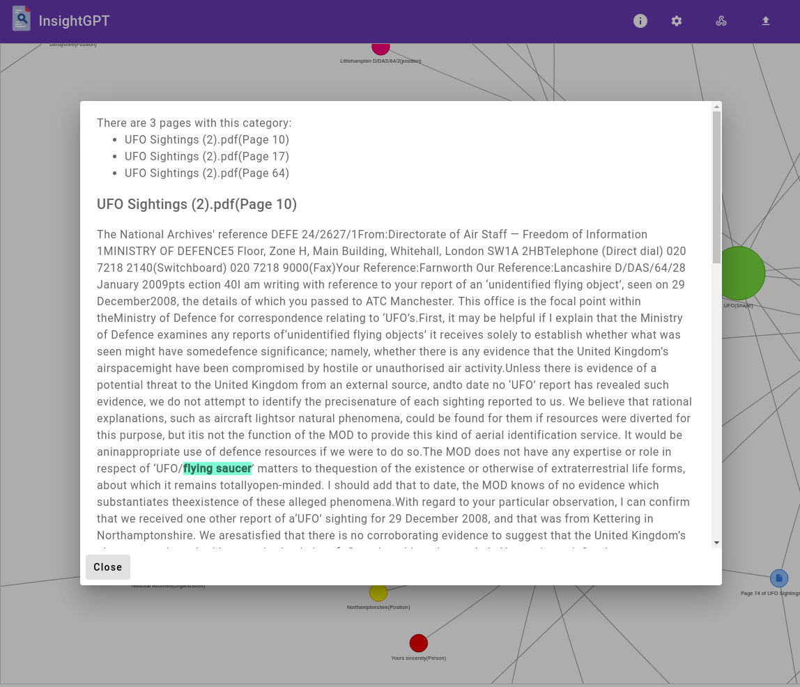
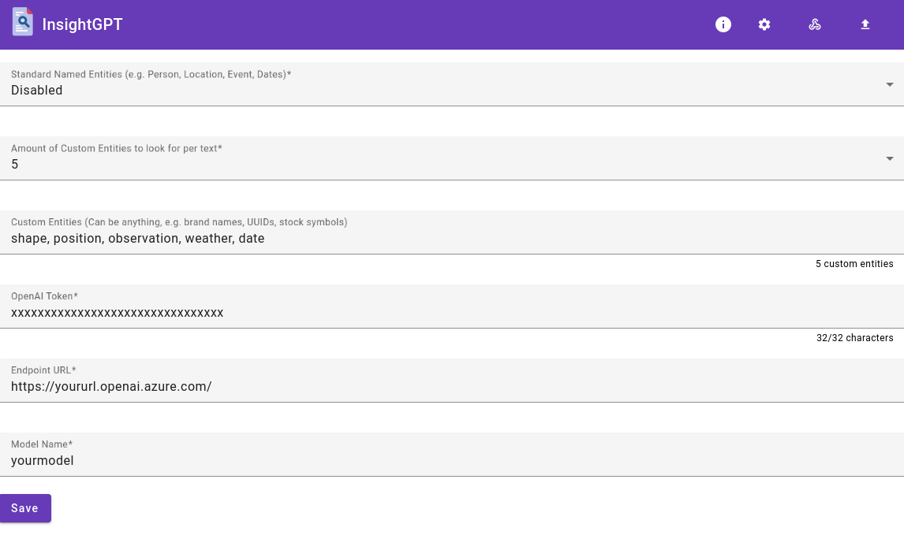

# InsightGPT

🤖💬 Large language models, such as GPT-3, have recently drawn a lot of interest. But can they be utilized for purposes other than chatbots?

📄🔎 InsightGPT allows users to upload PDF files for text extraction. Once the text is extracted, the power of GPT-3 is used to extract additional information such as location or date. By tweaking the settings, users are able to specify their own interests, such as the shape of an object or the type of observation. For example, if a user is analyzing UAP / UFO sightings, they can quickly view all relevant data, including location, date, shape, and observation type, all from a single interface. This makes it easy to identify patterns and similarities, such as multiple sightings from a single location or of a specific shape. With InsightGPT, users can easily and efficiently analyze text data to gain new insights and make data-driven decisions.

🚀🌕 Live Demo: https://aymenfurter.github.io/InsightGPT

## Features
* Upload PDF files for text extraction (In-Browser).
* Extract additional information from text using Azure OpenAI Service.
* Customize your interests about the extracted data through the settings.
* Start your analysis through the network view.

## Screenshots

Here's an example of InsightGPT in action, analyzing UFO sightings reports from [The National Archives](https://www.nationalarchives.gov.uk/ufos/):

## Installation

To install InsightGPT, follow these steps:

1. Clone the repository
2. Install the required dependencies using `npm install`
3. Run the application using `ng serve`

## Acknowledgements

InsightGPT is based on the following technologies:

* Angular
* Angular Material UI
* vis.js
* Typescript
* Material
* Azure OpenAI Service

## License
InsightGPT is licensed under the Apache License, Version 2.0.

## Disclaimer
The developers of InsightGPT are not responsible for any loss, injury, claim, liability, or damage related to your use of the application, whether from errors or omissions in the content of our website or any other linked sites, from the site being down, or from any other use of the site. Use at your own risk.
## Requirements

InsightGPT requires an [Azure Open AI Service](https://learn.microsoft.com/en-us/azure/cognitive-services/openai/) instance and an API Key.
